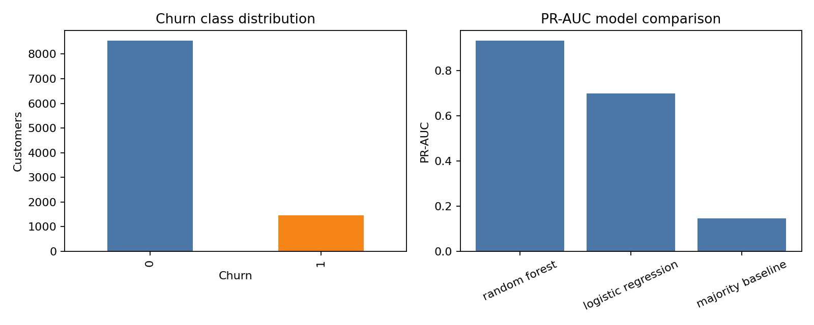
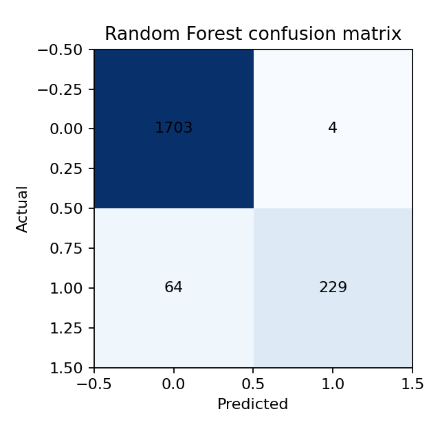
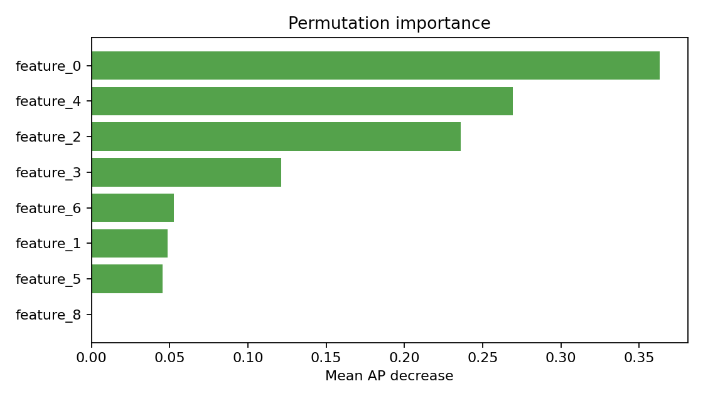

# Part 2 — Classification with an AI Coding Assistant

This experiment solves a customer-churn classification problem using a synthetic benchmark adapted from the AutoML example. It compares a majority-class baseline, logistic regression, and random forest, then evaluates the selected model using imbalance-aware metrics.

## Results at a glance

| Model | PR-AUC | ROC-AUC | F1 | Decision |
|---|---:|---:|---:|---|
| Majority baseline | 0.1465 | 0.5000 | 0.0000 | Baseline |
| Logistic regression | 0.6985 | 0.8615 | 0.6102 | Comparison |
| Random forest | **0.9320** | **0.9624** | **0.8707** | **Selected** |

Random forest was selected by PR-AUC. Accuracy alone was not used because the churn class is imbalanced.







## Dataset and provenance

The benchmark contains 10,000 synthetic customer records, ten numeric features, and an approximately 14.25% churn rate. It is not a real customer dataset. The benchmark is generated reproducibly with seed `42` and is adapted from the [Data Science Examples repository](https://github.com/dlmastery/data_science_examples).

The audit checks shape, schema, missing values, duplicates, target balance, feature ranges, and possible identifier or target leakage. The target is excluded from the feature matrix.

## Method

1. Generated or loaded the benchmark with fixed seed `42`.
2. Audited missing values, duplicates, class balance, and feature structure.
3. Used a stratified 80/20 train/test split.
4. Compared a majority baseline, standardized logistic regression, and random forest.
5. Reported PR-AUC, ROC-AUC, F1, and threshold-dependent behavior.
6. Selected random forest using PR-AUC.
7. Exported the comparison table, confusion matrix, permutation importance, figures, metrics, and provenance to `artifacts/`.

## Responsible interpretation

Churn prediction is a statistical risk signal, not evidence of customer intent. Feature importance does not establish causation. A real use case would require real licensed data, calibration, fairness review, threshold-cost analysis, intervention testing, drift monitoring, and human oversight.

## Reproduce the experiment

```bash
python src/run_experiment.py --data data/customer_churn.csv --output artifacts
```

The notebook is a companion audit and artifact-inspection workflow. The command-line script and exported JSON are authoritative.

## Verification and provenance

- `artifacts/results-summary.json` records seed, dataset audit, split, models, selected method, metrics, artifacts, and limitations.
- `artifacts/model-comparison.csv` contains the exported comparison table.
- `artifacts/selected-confusion-matrix.png` shows test-set classification errors for the selected model.
- `artifacts/permutation-importance.csv` and `artifacts/permutation-importance.png` show the effect of shuffling each feature.
- `artifacts/model-comparison.png` visualizes the model metrics.
- `notebooks/customer-churn-classification.ipynb` documents the audit and metric review.
- `reports/experiment-summary.md` records the verified findings and limitations.

## Prompt engineering

[`PROMPTS.md`](PROMPTS.md) preserves the nine-stage prompt record used for planning, auditing, implementation, review, interpretation, visualization, and final consistency checking.
## Video walkthrough

**YouTube URL:**
## References

1. [Data Science Examples](https://github.com/dlmastery/data_science_examples).
2. [scikit-learn model evaluation](https://scikit-learn.org/stable/modules/model_evaluation.html).
3. [scikit-learn pipelines](https://scikit-learn.org/stable/modules/compose.html).

## AI-assistance disclosure

The AI coding assistant supported experiment design, implementation, debugging, visualization, documentation, and review. Conclusions were checked against executed code and exported artifacts.
