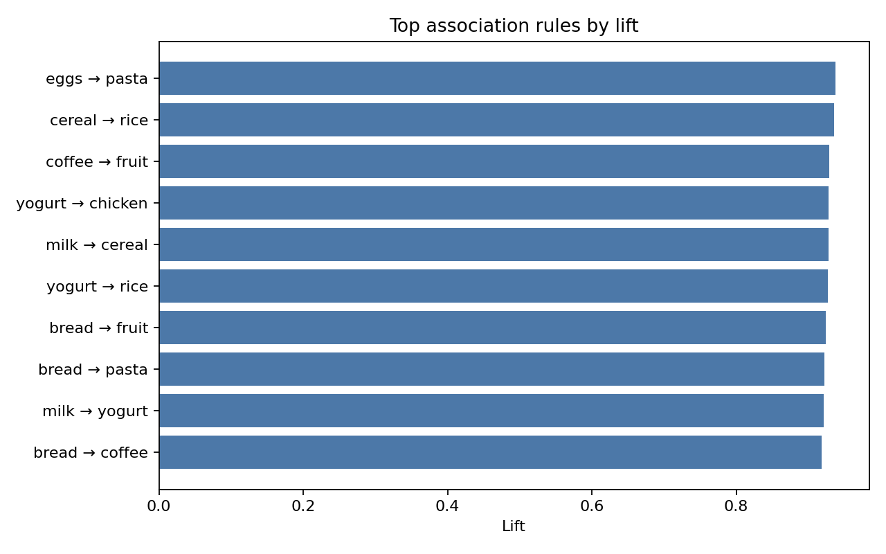

# Part 2 — Association Mining with an AI Coding Assistant

This experiment solves an association-mining problem using Instacart-style synthetic grocery transactions. It audits basket structure, generates item-pair rules, and evaluates support, confidence, and lift.

## Results at a glance

| Result | Value |
|---|---:|
| Transactions | 10,000 |
| Minimum support | 0.035 |
| Generated rules | **45** |
| Highest observed lift | **0.9377** |
| Selected workflow | Apriori-style rule generation |

Rules describe co-occurrence and do not establish preference or causation.



## Dataset and provenance

The benchmark contains 10,000 synthetic grocery baskets generated with seed `42`. It has ten candidate items and is not a redistribution of the original Instacart dataset. The methodological reference is the [Data Science Examples repository](https://github.com/dlmastery/data_science_examples).

The audit checks transaction count, unique items, basket sizes, item frequencies, duplicate items, empty baskets, and basket representation.

## Method

1. Generated or loaded transactions with fixed seed `42`.
2. Audited transaction count, item count, basket size, and item frequencies.
3. Applied minimum support `0.035` and maximum itemset length two.
4. Compared Apriori-style candidate generation with an ECLAT reference approach.
5. Computed support, confidence, and lift for item pairs.
6. Sorted and exported rules by lift.
7. Reconciled the rule count and top lift with `results-summary.json`.
8. Exported Apriori rules, ECLAT rules, algorithm-level comparison metrics, and a top-rule figure.

## Responsible interpretation

Association describes items appearing together; it does not prove customer preference, causation, or guaranteed cross-selling response. Any recommendation would require controlled testing, seasonality review, product-availability checks, privacy review, and customer-impact assessment.

## Reproduce the experiment

```bash
python src/run_experiment.py --data data/transactions.json --output artifacts
```

The notebook performs the transaction audit and rule inspection. The script and exported artifacts are authoritative.

## Verification and provenance

- `artifacts/results-summary.json` records seed, dataset, thresholds, algorithms, metrics, artifacts, and limitations.
- `artifacts/apriori-rules.csv` contains the exported rules.
- `artifacts/eclat-rules.csv` provides the independent reference implementation output.
- `artifacts/algorithm-comparison.csv` compares rule counts, top lift, and runtime for both implementations.
- `artifacts/top-rules.png` visualizes the highest-lift rules.
- `notebooks/market-basket-mining.ipynb` documents the audit and rule review.
- `reports/experiment-summary.md` records the verified findings and limitations.

## Prompt engineering

[`PROMPTS.md`](PROMPTS.md) preserves the nine-stage prompt record used for planning, auditing, implementation, review, interpretation, visualization, and final consistency checking.

## Video walkthrough

**YouTube URL:**
## References

1. [Data Science Examples](https://github.com/dlmastery/data_science_examples).
2. Agrawal, R., & Srikant, R. (1994). [Fast algorithms for mining association rules](https://doi.org/10.1007/BF00993309).

## AI-assistance disclosure

The AI coding assistant supported experiment design, implementation, debugging, metric interpretation, documentation, and review. Conclusions were checked against executed code and exported artifacts.
