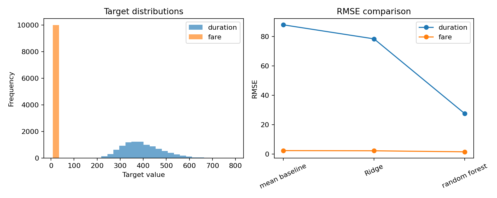
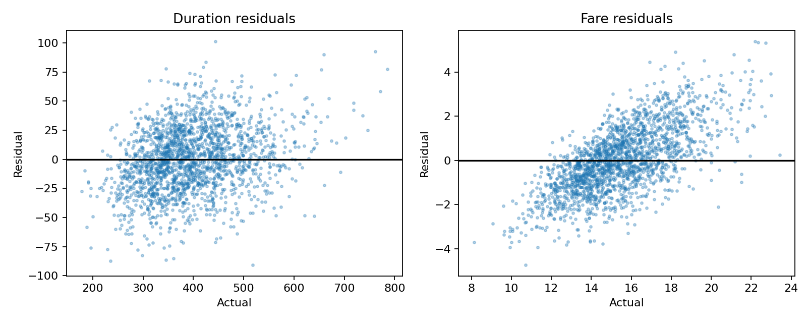

# Part 2 — Regression with an AI Coding Assistant

This experiment solves two regression problems for synthetic NYC taxi trips: trip duration and fare. It compares baseline and nonlinear regression methods while preventing target leakage.

## Results at a glance

| Target | Selected method | RMSE | R² |
|---|---|---:|---:|
| Trip duration | Random forest | **27.45 seconds** | **0.9024** |
| Fare | Random forest | **1.4824** | **0.5904** |

Models were selected using RMSE after comparison with a mean baseline and Ridge regression.





## Dataset and provenance

The benchmark contains 10,000 synthetic taxi trips generated with seed `42`. It includes six numeric predictor features and separate duration and fare targets. It is not a real NYC taxi dataset. The methodological reference is the [Data Science Examples repository](https://github.com/dlmastery/data_science_examples).

The audit checks shape, schema, missing values, duplicates, target ranges, and possible leakage. Duration and fare are removed before fitting the predictor matrix.

## Method

1. Generated or loaded the synthetic trip data with fixed seed `42`.
2. Audited predictors, targets, missing values, duplicates, and ranges.
3. Used a deterministic 80/20 train/test split.
4. Compared a mean baseline, Ridge regression, and random forest.
5. Evaluated duration and fare separately using RMSE and R².
6. Selected random forest using RMSE.
7. Exported the full comparison table, selected-model results, model-comparison figure, residual diagnostics, and provenance.

## Responsible interpretation

These results demonstrate a reproducible workflow, not real travel-time or fare accuracy. A production use case would require licensed trip data, temporal validation, traffic and weather variables, calibration, drift monitoring, and evaluation across neighborhoods and times.

## Reproduce the experiment

```bash
python src/run_experiment.py --data data/nyc_taxi.csv --output artifacts
```

The notebook provides an audit and exported-result review. The command-line script and JSON artifact are authoritative.

## Verification and provenance

- `artifacts/results-summary.json` records seed, dataset audit, split, models, selected method, metrics, artifacts, and limitations.
- `artifacts/model-comparison.csv` contains baseline and model metrics for both targets.
- `artifacts/selected-models.csv` contains the exported target-level results.
- `artifacts/model-comparison.png` compares target distributions and RMSE across methods.
- `artifacts/residual-diagnostics.png` checks residual behavior for the selected models.
- `notebooks/nyc-taxi-regression.ipynb` documents the audit and results review.
- `reports/experiment-summary.md` records the verified findings and limitations.

## Prompt engineering

[`PROMPTS.md`](PROMPTS.md) preserves the nine-stage prompt record used for planning, auditing, implementation, review, interpretation, visualization, and final consistency checking.
## Video walkthrough

**YouTube URL:**
## References

1. [Data Science Examples](https://github.com/dlmastery/data_science_examples).
2. [scikit-learn regression metrics](https://scikit-learn.org/stable/modules/model_evaluation.html).

## AI-assistance disclosure

The AI coding assistant supported experiment design, feature engineering, implementation, debugging, documentation, and review. Conclusions were checked against executed code and exported artifacts.
