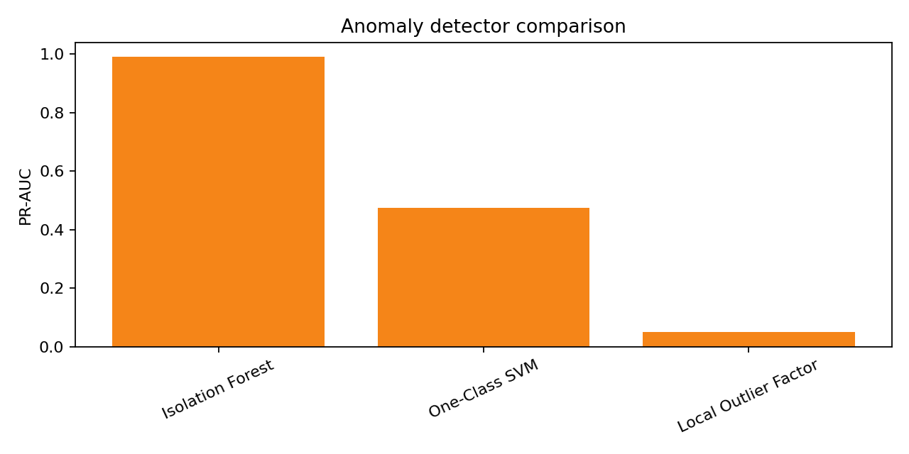
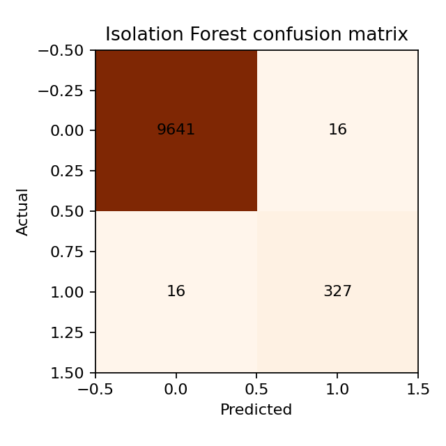

# Part 2 — Anomaly Detection with an AI Coding Assistant

This experiment solves an anomaly-detection problem using synthetic server telemetry. It compares unsupervised detection methods and emphasizes ranking quality and false-alert risk.

## Results at a glance

| Result | Value |
|---|---:|
| Rows | 10,000 |
| Signals | 6 |
| Anomaly rate | 3.43% |
| Selected method | Isolation Forest |
| PR-AUC | **0.9908** |
| ROC-AUC | **0.9995** |

Isolation Forest was selected using PR-AUC because anomalies are rare.





## Dataset and provenance

The benchmark contains 10,000 synthetic telemetry records, six numeric signals, and known anomaly labels used only for evaluation. It is not production telemetry. The methodological reference is the [Data Science Examples repository](https://github.com/dlmastery/data_science_examples).

The audit checks schema, missing values, duplicate rows, time ordering, feature ranges, anomaly prevalence, and anomaly archetypes.

## Method

1. Generated or loaded synthetic telemetry with fixed seed `42`.
2. Audited signal ranges, missing values, duplicates, and anomaly prevalence.
3. Kept labels for evaluation only and did not use them to fit the detector.
4. Compared robust z-score, Isolation Forest, Local Outlier Factor, and One-Class SVM.
5. Reported PR-AUC, ROC-AUC, precision, recall, F1, alert rate, and false-positive behavior.
6. Selected Isolation Forest using PR-AUC.
7. Exported model comparisons, confusion-matrix evidence, feature-deviation evidence, and provenance.

## Responsible interpretation

An anomaly alert is a signal for investigation, not proof of an attack or system failure. Performance depends on contamination assumptions, thresholds, drift, and operating conditions. A real deployment would require analyst feedback, alert-volume limits, drift monitoring, and documented response procedures.

## Reproduce the experiment

```bash
python src/run_experiment.py --data data/server_telemetry.csv --output artifacts
```

The notebook provides an audit and exported-result review. The command-line script and JSON artifact are authoritative.

## Verification and provenance

- `artifacts/results-summary.json` records seed, dataset audit, label usage, methods, selected method, metrics, artifacts, and limitations.
- `artifacts/model-comparison.csv` contains the exported comparison result.
- `artifacts/model-comparison.png` compares ranking and threshold metrics across detectors.
- `artifacts/selected-confusion-matrix.png` shows the selected detector's thresholded errors.
- `artifacts/anomaly-feature-deviations.csv` summarizes feature deviations among detected anomalies.
- `notebooks/server-telemetry-anomaly-detection.ipynb` documents the audit and metric review.
- `reports/experiment-summary.md` records the verified findings and limitations.

## Prompt engineering

[`PROMPTS.md`](PROMPTS.md) preserves the nine-stage prompt record used for planning, auditing, implementation, review, interpretation, visualization, and final consistency checking.

## References

1. [Data Science Examples](https://github.com/dlmastery/data_science_examples).
2. [scikit-learn outlier detection](https://scikit-learn.org/stable/modules/outlier_detection.html).

## AI-assistance disclosure

The AI coding assistant supported experiment design, implementation, debugging, evaluation, visualization, documentation, and review. Conclusions were checked against executed code and exported artifacts.
