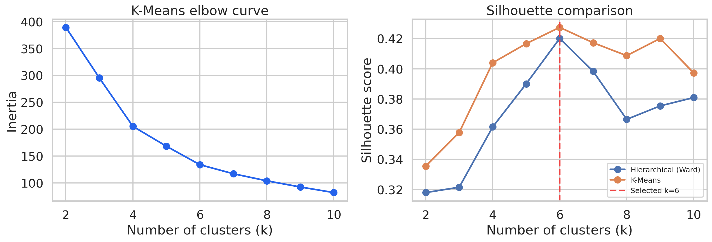
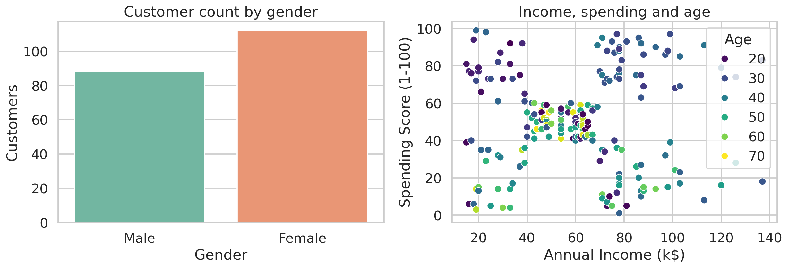
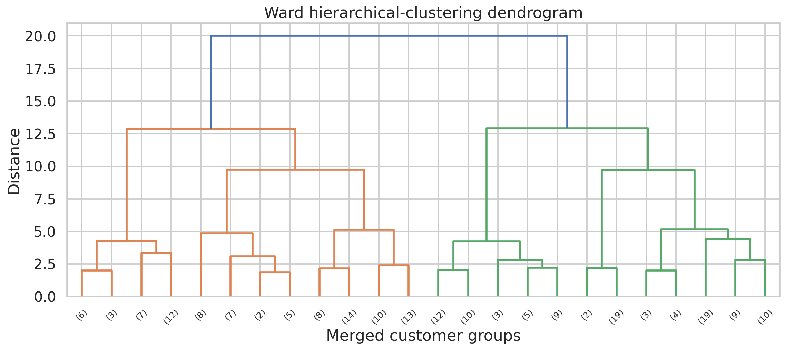
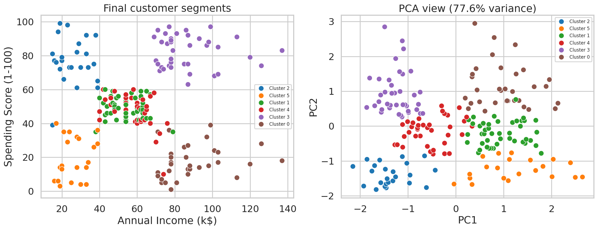
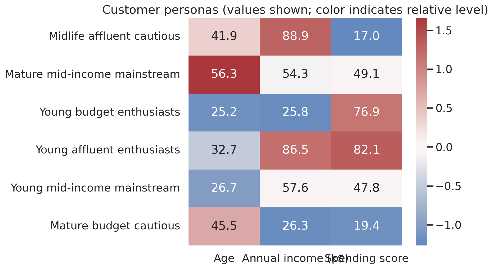

# Part 2 — Customer Segmentation with an AI Coding Assistant

This project replicates and extends a customer-clustering experiment using an AI coding assistant. It segments customers from the popular Mall Customers dataset by age, annual income, and spending score, compares three clustering approaches, and converts the selected clusters into interpretable descriptive personas.

## Results at a glance

| Approach | Best configuration | Silhouette | Coverage | Decision |
|---|---|---:|---:|---|
| K-Means | **k = 6** | **0.4274** | **100%** | Selected |
| Hierarchical (Ward) | k = 6 | 0.4201 | 100% | Strong comparison |
| DBSCAN | eps = 0.55, min_samples = 8 | 0.5158* | 69% | Not selected |

\*The DBSCAN silhouette score is calculated only on non-noise observations. Its 31% noise rate makes the raw value inappropriate for direct comparison with methods assigning every customer. K-Means was selected because it produced the strongest full-coverage silhouette score and straightforward business profiles.



## Dataset

The [Mall Customer Segmentation Data](https://www.kaggle.com/datasets/vjchoudhary7/customer-segmentation-tutorial-in-python) contains 200 customer records with five columns:

- Customer ID
- Gender
- Age
- Annual income in thousands of dollars
- Spending score from 1 to 100

The audit found no missing values, duplicate rows, or duplicate customer IDs. `CustomerID` was treated strictly as an identifier, and `Gender` was retained for post-cluster description rather than used to form clusters.

The raw dataset is not redistributed. Download `Mall_Customers.csv` from Kaggle and place it under `data/`.



## Method

1. Audited the schema, missing values, duplicates, ranges, and identifiers.
2. Selected age, annual income, and spending score as behavioral/demographic clustering features.
3. Standardized all three features with `StandardScaler` so their measurement scales had equal influence.
4. Compared K-Means and Ward hierarchical clustering for `k = 2` through `k = 10`.
5. Tuned DBSCAN over a documented grid and evaluated both cluster quality and customer coverage.
6. Compared silhouette, Davies–Bouldin, and Calinski–Harabasz metrics.
7. Selected six-cluster K-Means and described the resulting groups using cluster means.
8. Used PCA only for visualization; it was not used to train the final model.



## Final customer segments

The six K-Means clusters cover all 200 customers. Persona names are descriptive summaries of cluster averages—not psychological profiles or causal claims.

| Persona | Customers | Mean age | Mean income (k$) | Mean spending score |
|---|---:|---:|---:|---:|
| Midlife affluent cautious | 33 | 41.9 | 88.9 | 17.0 |
| Mature mid-income mainstream | 45 | 56.3 | 54.3 | 49.1 |
| Young budget enthusiasts | 24 | 25.2 | 25.8 | 76.9 |
| Young affluent enthusiasts | 39 | 32.7 | 86.5 | 82.1 |
| Young mid-income mainstream | 38 | 26.7 | 57.6 | 47.8 |
| Mature budget cautious | 21 | 45.5 | 26.3 | 19.4 |





## Responsible interpretation

- These clusters describe this small dataset and are not guaranteed to generalize to another mall or time period.
- Internal validation measures separation, not business value or causal impact.
- Gender was excluded from model training to avoid forming segments directly from a sensitive demographic attribute.
- Customer IDs were excluded because identifiers carry no meaningful behavioral distance.
- A production use case would need external validation, stability testing, campaign outcomes, drift monitoring, and periodic retraining.

## Reproduce the experiment

```bash
python -m venv .venv

# Windows
.venv\Scripts\activate

# macOS/Linux
source .venv/bin/activate

pip install -r requirements.txt
python src/run_experiment.py --data data/Mall_Customers.csv --output artifacts
```

The script uses a fixed random seed and writes all metrics, customer assignments, profiles, and figures to `artifacts/`.

## Prompt engineering

[`PROMPTS.md`](PROMPTS.md) preserves the principal prompts used to plan, implement, test, audit, and explain the work. The sequence demonstrates role prompting, context grounding, explicit constraints, staged decomposition, output contracts, evidence requirements, adversarial review, and iterative refinement.

## Repository structure

```text
Part-2-Coding-Assistant/
├── README.md
├── PROMPTS.md
├── requirements.txt
├── data/
│   └── README.md
├── notebooks/
│   └── customer-segmentation.ipynb
├── src/
│   └── run_experiment.py
├── artifacts/
│   ├── *.png
│   ├── *.csv
│   └── *.json
└── reports/
    └── experiment-summary.md
```

## Video walkthrough

**YouTube URL:** 

## Coding-assistant conversation

The complete AI-assisted development conversation is included for transparency and assignment documentation:

- [Coding-assistant chat transcript (PDF)](reports/coding-assistant-chat-transcript.pdf)
- [Curated prompt-engineering record](PROMPTS.md)
## AI-assistance disclosure

Codex assisted with experiment design, code generation, debugging, validation, visualization, and documentation. The conclusions in this repository are grounded in the executed experiment and exported artifacts. AI-generated suggestions were checked against the source data and computed metrics before inclusion.

