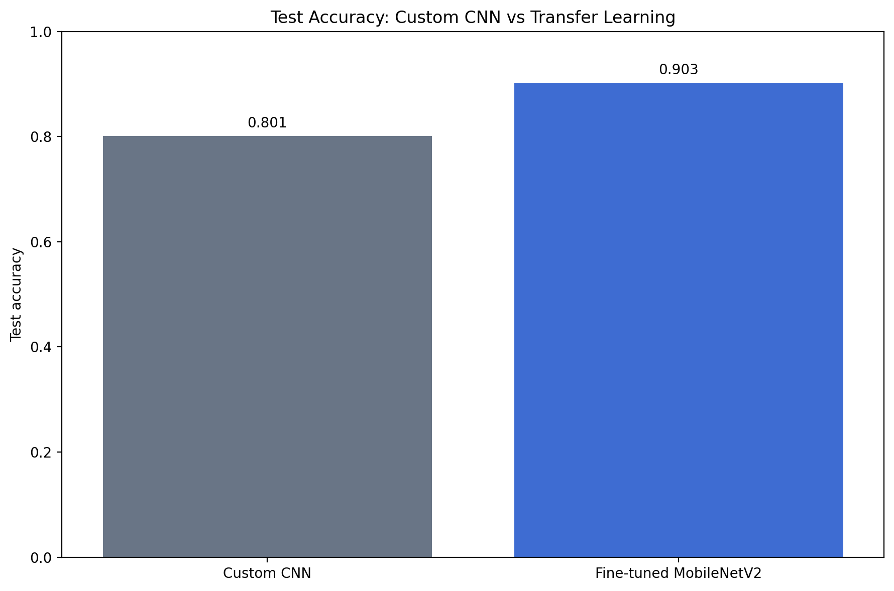
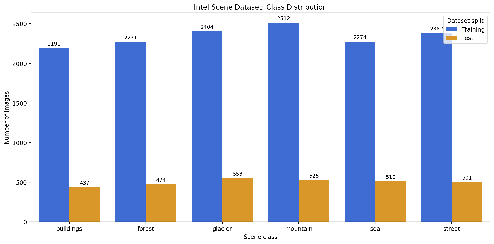
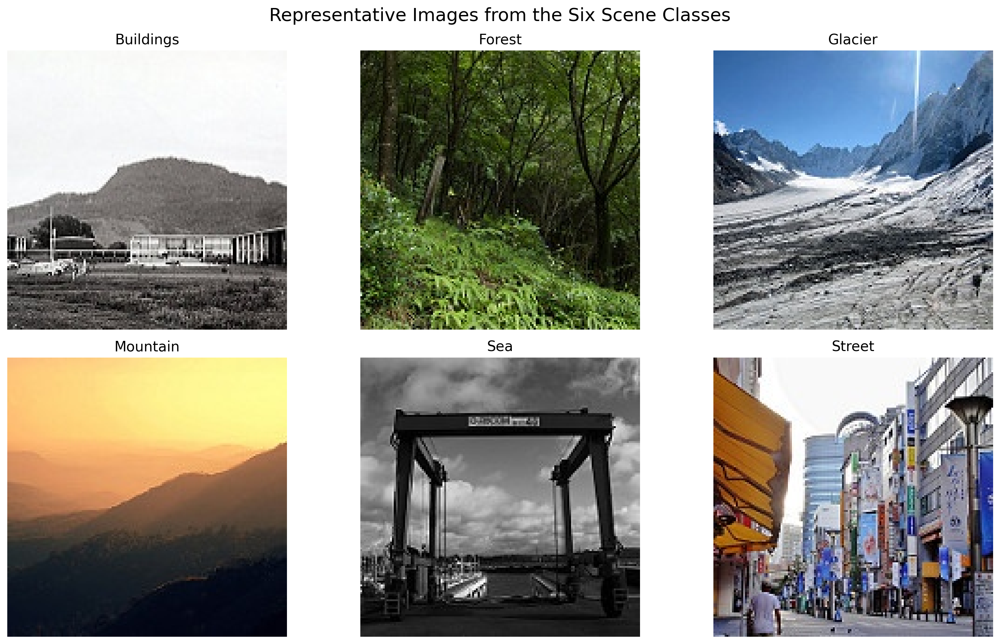
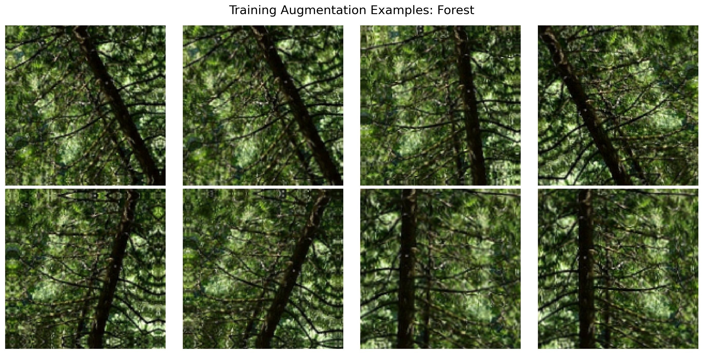
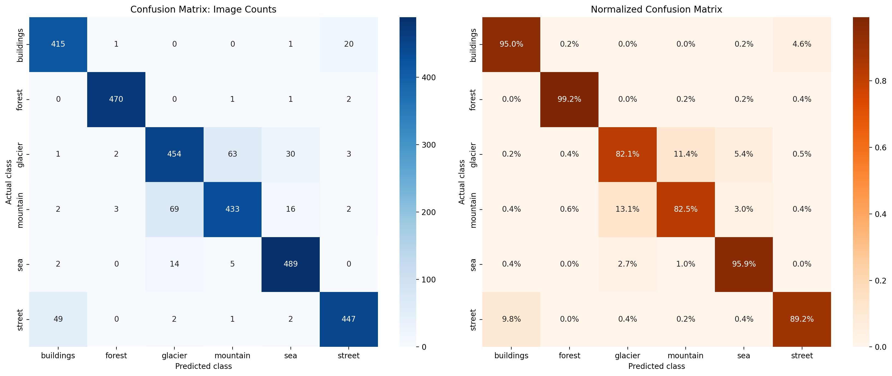
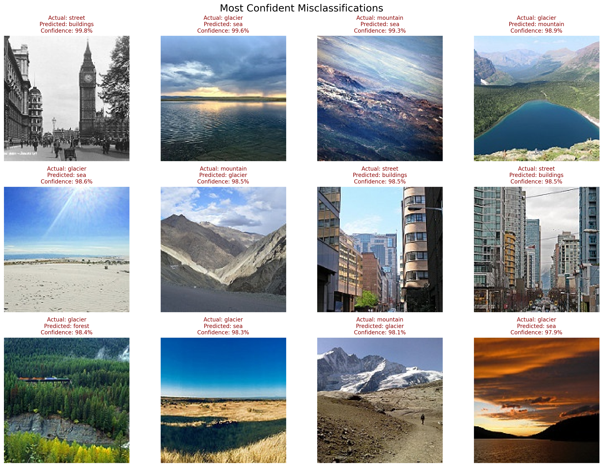
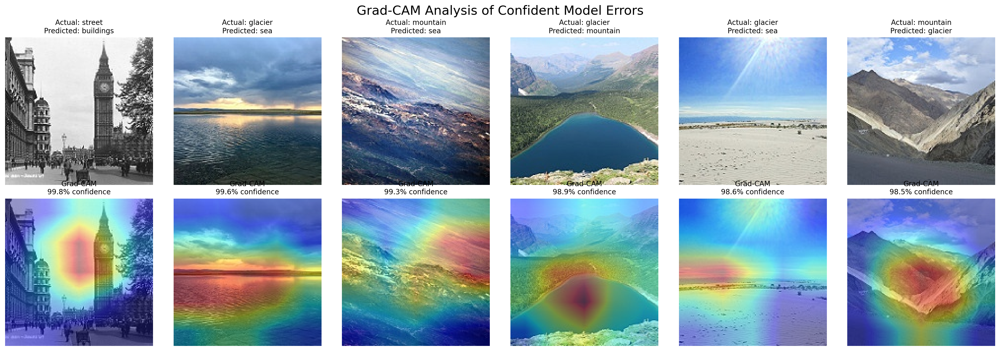

# Assignment 1 — Intel Scene Classification with Deep Learning

An end-to-end, chatbot-assisted computer-vision project that classifies natural scenes into six categories using a custom convolutional neural network and transfer learning with MobileNetV2. The workflow follows CRISP-DM and includes data auditing, augmentation, model comparison, fine-tuning, error analysis, and Grad-CAM explainability.

[View the executed Kaggle notebook](https://www.kaggle.com/code/navyai9/intel-scene-classification-with-deep-learning)

## Results at a glance

| Model | Test accuracy | Test loss | Macro precision | Macro recall | Macro F1 |
|---|---:|---:|---:|---:|---:|
| Custom CNN | 80.10% | 0.5698 | — | — | — |
| Fine-tuned MobileNetV2 | **90.27%** | **0.2487** | **90.43%** | **90.63%** | **90.48%** |

The saved Kaggle version was run from beginning to end. Its exported metrics are treated as authoritative throughout this repository.



## Dataset

The [Intel Image Classification dataset](https://www.kaggle.com/datasets/puneet6060/intel-image-classification) contains natural-scene photographs in six classes:

- Buildings
- Forest
- Glacier
- Mountain
- Sea
- Street

The project used 11,228 training images, 2,806 validation images, and an untouched test set of 3,000 images. The test set remained ordered and unseen during training and model selection.





## CRISP-DM workflow

### 1. Business understanding

The task is multiclass scene recognition. A reliable classifier could support photo organization, geographic-content indexing, or visual search. The goal is not only strong accuracy, but also transparent failure analysis.

### 2. Data understanding

The directory structure, file counts, labels, and class distributions were audited before modeling. The six classes are reasonably balanced, making accuracy meaningful, although macro-averaged metrics were also reported to give every class equal importance.

### 3. Data preparation

- Images were resized to 150 × 150 pixels.
- A fixed seed of 42 controlled dataset partitioning and supported reproducibility.
- The original training directory was divided into 80% training and 20% validation data.
- Horizontal flips, small rotations, zoom, and contrast changes were applied only during training.
- The test data was loaded with `shuffle=False` to preserve alignment between paths, labels, and predictions.



### 4. Modeling

Two genuine deep-learning approaches were compared:

1. **Custom CNN:** four convolutional blocks with batch normalization, max pooling, global average pooling, dropout, and a six-class softmax head.
2. **MobileNetV2 transfer learning:** ImageNet-pretrained features with a new classifier head, followed by selective fine-tuning of the final 30 layers while keeping batch-normalization layers frozen.

Training used two NVIDIA T4 GPUs through TensorFlow `MirroredStrategy`. Early stopping, learning-rate reduction, and best-model checkpoints controlled overfitting.

### 5. Evaluation

The fine-tuned MobileNetV2 reached 90.27% test accuracy and 90.48% macro-F1. Forest was the easiest class, with 98.95% F1. Glacier and mountain were the hardest, with F1 scores of 83.15% and 84.24%.

| Class | Precision | Recall | F1 | Support |
|---|---:|---:|---:|---:|
| Buildings | 88.49% | 94.97% | 91.61% | 437 |
| Forest | 98.74% | 99.16% | 98.95% | 474 |
| Glacier | 84.23% | 82.10% | 83.15% | 553 |
| Mountain | 86.08% | 82.48% | 84.24% | 525 |
| Sea | 90.72% | 95.88% | 93.23% | 510 |
| Street | 94.30% | 89.22% | 91.69% | 501 |

The largest directional confusions were:

- 69 mountain images predicted as glacier
- 63 glacier images predicted as mountain
- 49 street images predicted as buildings





### 6. Deployment

A lightweight deployment could accept an uploaded image, apply the same MobileNetV2 preprocessing, and return class probabilities with a confidence indicator. Production monitoring should track input drift, confidence calibration, class-specific recall, and newly emerging scene types. Low-confidence cases should be routed for review rather than treated as certain.

## Explainability

Grad-CAM was applied to confident errors to identify image regions that most influenced the predicted class. The heatmaps show attention around structures, horizons, snow, water, and terrain. Grad-CAM helps inspect model behavior but does not prove causal reasoning or guarantee that a highlighted region is semantically meaningful.



## Reproducibility

Run the notebook on Kaggle with the Intel Image Classification dataset attached, Internet enabled for the pretrained weights, and a GPU accelerator. The saved notebook uses TensorFlow 2.20.0 and two T4 GPUs.

Key reproducibility details:

- Random seed: 42
- Image size: 150 × 150
- Batch size: 64
- Validation fraction: 20%
- Final evaluation: one untouched 3,000-image test set
- Metrics source: `artifacts/results-summary.json` and the exported CSV files

Dual-GPU deep learning may still show small run-to-run differences because some GPU operations and parallel reductions are nondeterministic.

## Repository structure

```text
Assignment-1/
├── README.md
├── article/
│   └── medium-article.md
├── artifacts/
│   ├── *.png
│   ├── *.csv
│   ├── *.json
│   └── *.keras
├── data/
│   └── README.md
├── notebook/
│   └── intel-scene-classification-with-deep-learning.ipynb
├── prompts/
│   ├── custom-instructions.md
│   └── prompts-used.md
├── reports/
│   └── README.md
├── .gitignore
├── requirements.txt
```

## AI-assistance disclosure

ChatGPT/Codex assisted with planning, code generation, debugging, model interpretation, documentation, and article drafting. All reported results were produced by the executed Kaggle notebook and reconciled against its exported artifacts. The custom instructions and principal prompts are preserved under `prompts/`; the complete exported conversation is placed under `reports/`.

## Medium article 

**Medium URL:** [Teaching a Neural Network to Recognize Natural Scenes: From a Custom CNN to Explainable Transfer Learning](https://medium.com/@9navya9/teaching-a-neural-network-to-recognize-natural-scenes-from-a-custom-cnn-to-explainable-transfer-b404798e954a)

## Author

Navya Illa  
Student ID: 020780084
